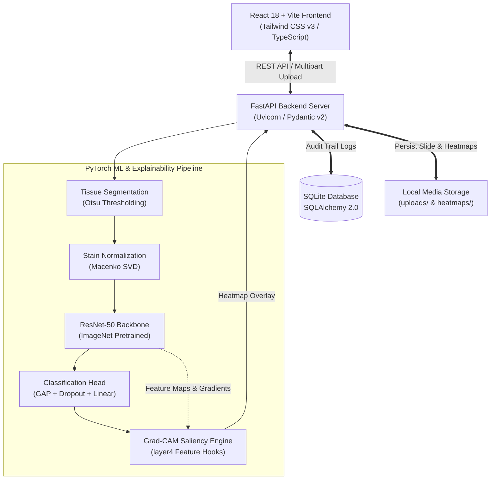

# TNBC-PROJECT
# TNBC-Insight AI

### Explainable AI-Based Histopathological Analysis and Molecular Subtype Prediction of Triple-Negative Breast Cancer

[](docs/ethics.md)
[](https://www.python.org/)
[](https://fastapi.tiangolo.com/)
[](https://pytorch.org/)
[](https://react.dev/)
[](https://www.typescriptlang.org/)
[](https://tailwindcss.com/)
[](LICENSE)

---

> [!CAUTION]
> ### MEDICAL RESEARCH DISCLAIMER
> **RESEARCH PROTOTYPE ONLY — NOT A MEDICAL DIAGNOSTIC DEVICE**  
> TNBC-Insight AI is an academic and translational research prototype created strictly for computational pathology investigation, algorithmic education, and biomarker discovery. **This system is NOT cleared or approved by the FDA, EMA, or any regulatory body as a diagnostic tool, software as a medical device (SaMD), or in vitro diagnostic (IVD) device.**  
> Predictions, scores, and visual heatmaps generated by this platform must **never** be used for primary diagnosis, patient stratification, treatment selection, or clinical decision-making. All histopathological interpretations must be conducted by certified pathologists in conjunction with validated immunohistochemistry (IHC) and genomic sequencing.

---

## Overview

**Triple-Negative Breast Cancer (TNBC)** represents approximately 15–20% of all invasive breast carcinomas and is characterized by the absence of Estrogen Receptor (ER), Progesterone Receptor (PR), and Human Epidermal Growth Factor Receptor 2 (HER2) amplification. Historically treated as a single aggressive disease entity with poor clinical outcomes, pioneering genomic studies (Lehmann et al.) have revealed that TNBC comprises distinct molecular subtypes with markedly different biology, chemosensitivity, and clinical courses:

1. **Basal-like 1 (BL1)**: High cell cycle activation, DNA damage response deficits, high sensitivity to DNA cross-linking agents (e.g. Cisplatin) and PARP inhibitors.
2. **Basal-like 2 (BL2)**: Enriched in growth factor signaling (EGFR, MET), glycolysis, and myoepithelial differentiation markers.
3. **Mesenchymal (M)**: Characterized by cell motility, epithelial-to-mesenchymal transition (EMT), extracellular matrix remodeling, and angiogenesis.
4. **Luminal Androgen Receptor (LAR)**: Driven by androgen receptor ($AR^+$) signaling and luminal gene expression; candidates for anti-androgen and CDK4/6 inhibitor therapy.

**TNBC-Insight AI** investigates whether these complex genomic phenotypes manifest identifiable morphologic signatures in standard **Hematoxylin and Eosin (H&E)** stained whole-slide histopathology images. The platform combines deep transfer learning (ResNet-50), optical density stain deconvolution (Macenko normalization), and visual interpretability (Grad-CAM) in a modern clinical research environment.

---

## Key Features

- **Molecular Subtype Prediction**: Classifies H&E tissue patches into the 4 validated Lehmann subtypes (BL1, BL2, M, LAR) with complete probability distributions.
- **Explainable AI with Grad-CAM**: Generates high-fidelity gradient-weighted activation heatmaps highlighting histological structures and cellular microenvironments that drove the prediction.
- **Macenko Stain Normalization**: Deconstructs optical density vectors using Singular Value Decomposition (SVD) to eliminate inter-laboratory staining and scanner variations.
- **Tissue Detection & Tiling**: Automated Otsu luminance thresholding for background glass separation and artifact filtering (blur detection, pen ink removal).
- **Instant Demo Mode**: Operates out of the box with zero setup—uses deterministic feature analysis and synthetic heatmaps when trained model weights are not loaded.
- **Seamless Model Upgrades**: Automatic detection of production PyTorch weights (`resnet50_tnbc.pth`), instantly switching from Demo Mode to Research Inference Mode without server restarts.
- **Interactive Dual-Layer Viewer**: Zoom, pan, and slide through transparent Grad-CAM overlays (0% to 100% alpha blending) with customizable color palettes (`JET`, `Turbo`).
- **Clinical Trial Matching**: Subtype-informed clinical trial database correlating predicted molecular phenotypes with ongoing targeted investigational therapies.
- **Persistent Audit Log**: Full tracking of patient/slide analyses, preprocessing logs, execution latencies, and probability vectors stored in SQLite.
- **Edge Deployment Ready**: Architecture tested and optimized for edge devices including the **NVIDIA Jetson Orin Nano** via ONNX and TensorRT.

---

## Screenshots

| Clinical Research Dashboard | Interactive Grad-CAM Heatmap Viewer |
| :---: | :---: |
|  |  |
| *High-throughput patch analysis and probability charts* | *Real-time alpha blending overlay on H&E tissue* |

| Subtype Characteristics & Trials | Preprocessing Pipeline Visualizer |
| :---: | :---: |
|  |  |
| *Genomic markers and matched investigational trials* | *Otsu tissue mask and Macenko stain separation* |

*(Note: If screenshots are not present in your local checkout, generate demo runs via the dashboard UI).*

---

## System Architecture

The platform follows a decoupled, stateless microservices architecture designed for high inference throughput and reproducible research:



For complete architectural specifications, see [docs/architecture.md](docs/architecture.md).

---

## Tech Stack

| Layer | Technologies | Purpose |
| :--- | :--- | :--- |
| **Backend Core** | Python 3.10+, FastAPI, Uvicorn, Pydantic v2 | High-concurrency asynchronous REST API and validation |
| **Machine Learning** | PyTorch 2.x, Torchvision, Scikit-learn, NumPy | Deep residual learning, transfer learning, and gradient hooks |
| **Computer Vision** | OpenCV (`opencv-python-headless`), Pillow | Macenko stain deconvolution, Otsu segmentation, color mapping |
| **Frontend SPA** | React 18, TypeScript, Vite, Tailwind CSS v3 | Type-safe, reactive single page application with modern UI |
| **Icons & UI** | Lucide React, Axios | Clean medical iconography and HTTP communication |
| **Database** | SQLite, SQLAlchemy 2.0 ORM | Zero-dependency local persistence (swappable to PostgreSQL) |
| **Deployment** | Docker, Docker Compose, Nginx, TensorRT | Containerization, reverse proxying, and NVIDIA edge acceleration |

---

## Project Structure

```
tnbc-insight-ai/
├── README.md                     # Primary repository documentation
├── docker-compose.yml            # Multi-container orchestration (backend + frontend)
├── .env.example                  # Environment variable configuration template
├── backend/
│   ├── Dockerfile                # Python 3.11 slim backend container definition
│   ├── requirements.txt          # Python dependency specifications
│   ├── app/
│   │   ├── __init__.py
│   │   ├── main.py               # FastAPI application entry point, CORS, and routing
│   │   ├── config.py             # Environment configuration and settings
│   │   ├── api/                  # Modular REST API route handlers
│   │   │   ├── analysis.py       # Patch analysis, inference, and upload handling
│   │   │   ├── health.py         # System health, hardware status, and ping
│   │   │   ├── model.py          # Model weights status and performance metrics
│   │   │   ├── reference.py      # Subtype descriptions and clinical trials
│   │   │   └── system.py         # System settings and environment details
│   │   ├── database/             # SQLAlchemy ORM configuration & schemas
│   │   │   ├── base.py           # Database engine, session maker, and Base model
│   │   │   └── models.py         # Analysis and inference database records
│   │   ├── schemas/              # Pydantic request and response contracts
│   │   │   ├── analysis.py
│   │   │   └── reference.py
│   │   └── services/             # Core business and inference orchestration logic
│   ├── ml/                       # Machine learning and computer vision pipeline
│   │   ├── __init__.py
│   │   ├── model.py              # ResNet50TNBC architecture definition
│   │   ├── preprocessing.py      # Tissue segmentation, Otsu, and tensor preparation
│   │   ├── macenko.py            # Macenko stain deconvolution implementation
│   │   ├── gradcam.py            # Grad-CAM hook management and heatmap synthesis
│   │   ├── inference.py          # Dual-mode inference execution (Demo vs Real)
│   │   ├── train.py              # ResNet-50 training loop and optimizer setup
│   │   └── evaluation.py         # Multiclass validation metrics (AUROC, F1, Confusion)
│   ├── models/                   # Directory for PyTorch weights (.pth)
│   ├── uploads/                  # Temporary image uploads and generated overlays
│   ├── data/                     # Training patches and stain reference images
│   └── tests/                    # Pytest test suite for API and ML pipeline
├── frontend/
│   ├── Dockerfile                # Multi-stage build (Node 18 -> Nginx)
│   ├── nginx.conf                # Nginx proxy and static asset configuration
│   ├── package.json              # NPM dependencies and build scripts
│   ├── vite.config.ts            # Vite bundler configuration with proxy
│   ├── tailwind.config.js        # Medical research dark/light color palette
│   ├── src/
│   │   ├── main.tsx              # React entry point
│   │   ├── App.tsx               # Root component and client routing
│   │   ├── components/           # Reusable UI widgets (Viewer, Stepper, Cards)
│   │   ├── pages/                # Research dashboard, history, model, trials pages
│   │   └── services/             # Axios API client integrations
│   └── public/                   # Static favicon and assets
└── docs/
    ├── architecture.md           # System design, sequence diagrams, and rationale
    ├── model.md                  # ResNet-50 math, transfer learning, and Grad-CAM
    ├── dataset.md                # TCGA-BRCA 388 WSI cohort, tiling, and normalization
    ├── deployment.md             # Local, Docker, and NVIDIA Jetson Orin Nano guide
    └── ethics.md                 # Clinical safety, bias mitigation, and regulatory rules
```

---

## Installation & Setup

### Prerequisites
- **Python**: 3.10 or 3.11
- **Node.js**: 18.x LTS or 20.x LTS with `npm`
- **Git**
- *(Optional)* NVIDIA GPU with CUDA 11.8+ or 12.x for accelerated inference.

### 1. Clone the Repository
```bash
git clone https://github.com/tnbc-insight/tnbc-insight-ai.git
cd tnbc-insight-ai
```

### 2. Backend Setup
```bash
cd backend

# Create virtual environment
# Windows:
python -m venv venv
.\venv\Scripts\activate
# Linux/macOS:
python3 -m venv venv
source venv/bin/activate

# Install Python dependencies
pip install --upgrade pip
pip install -r requirements.txt

# Launch FastAPI development server
uvicorn app.main:app --reload --port 8000
```
- API root: `http://localhost:8000/api/health`
- Interactive OpenAPI Docs: `http://localhost:8000/docs`

### 3. Frontend Setup
Open a separate terminal:
```bash
cd frontend

# Install Node dependencies
npm install

# Start Vite dev server
npm run dev
```
- Frontend application: `http://localhost:5173`

---

## Operating Modes: Demo Mode vs. Real Model

TNBC-Insight AI incorporates a **Dual-Mode Inference Engine** designed to ensure the system is operational immediately without requiring massive model weights or GPU hardware:

| Mode | Trigger Condition | ML Inference Engine | Explainability Visualizer | Use Case |
| :--- | :--- | :--- | :--- | :--- |
| **Demo Mode** *(Default)* | `models/resnet50_tnbc.pth` is absent | Morphological heuristic analysis based on pixel intensity, saturation, and cellular edge density | Deterministic synthetic Grad-CAM heatmap aligned with detected cellular clusters | Rapid UI testing, system demonstrations, and client integration |
| **Research Mode** | `models/resnet50_tnbc.pth` is present | PyTorch `ResNet50TNBC` forward pass (CUDA/CPU) with Macenko stain deconvolution | Real mathematical Grad-CAM backpropagation from `layer4` convolutional filters | Scientific research, biomarker exploration, and model validation |

### How to Switch to the Real Model
1. Obtain or train the PyTorch model checkpoint (`resnet50_tnbc.pth`).
2. Place the file inside the backend models folder:
   ```bash
   # Copy model weights
   cp /path/to/trained/weights.pth backend/models/resnet50_tnbc.pth
   ```
3. Restart or reload the backend server. The backend initialization routine will detect the checkpoint:
   ```
   [INFO] Found model weights at models/resnet50_tnbc.pth. Loading PyTorch ResNet-50 model...
   [INFO] Model loaded successfully on device: cuda:0. Operating Mode: RESEARCH.
   ```

---

## Model Training

To train the ResNet-50 classifier on your local patch dataset:

### 1. Dataset Preparation
Organize normalized 512x512 patches into subtype directories:
```
backend/data/patches/
├── train/
│   ├── BL1/
│   ├── BL2/
│   ├── M/
│   └── LAR/
└── val/
    ├── BL1/
    ├── BL2/
    ├── M/
    └── LAR/
```

### 2. Execute Training Script
```bash
cd backend
python -m ml.train \
  --data-dir data/patches \
  --epochs 50 \
  --batch-size 32 \
  --lr 1e-4 \
  --weight-decay 1e-2 \
  --output-dir models/
```
The script will perform ImageNet warm-up, cosine annealing learning rate scheduling, class-weighted cross-entropy optimization, and save the best checkpoint to `models/resnet50_tnbc.pth`.

---

## API Reference

The backend exposes a clean, self-documenting REST API:

| Method | Endpoint | Description | Request Payload | Response |
| :--- | :--- | :--- | :--- | :--- |
| `GET` | `/api/health` | System health, mode (`demo`/`research`), hardware device | None | Status JSON |
| `POST` | `/api/analyze` | Ingests H&E patch, performs preprocessing, inference & Grad-CAM | `multipart/form-data` (file) | Analysis results, scores, image URLs |
| `POST` | `/api/preprocess` | Standalone tissue segmentation and Macenko stain extraction | `multipart/form-data` (file) | Stepwise preprocessing image assets |
| `GET` | `/api/history` | Retrieves paginated historical analysis sessions | Query params (`limit`, `offset`) | List of analysis records |
| `GET` | `/api/history/{id}` | Retrieves detailed metadata and heatmap URLs for an analysis | Analysis UUID | Complete analysis record |
| `DELETE`| `/api/history/{id}` | Deletes analysis record and corresponding cached files | Analysis UUID | Deletion confirmation |
| `GET` | `/api/subtypes` | Comprehensive biological profiles for all 4 TNBC subtypes | None | Subtype dictionary |
| `GET` | `/api/subtypes/{code}`| Profile for a specific subtype (`BL1`, `BL2`, `M`, `LAR`) | Path parameter | Subtype metadata object |
| `GET` | `/api/model/status` | Current model architecture, checkpoint status, and device | None | Diagnostics report |
| `GET` | `/api/model/metrics` | Model validation performance metrics (AUROC, F1, accuracy) | None | Benchmark metrics JSON |
| `GET` | `/api/trials` | Subtype-matched investigational clinical trials | Query param (`subtype`) | List of clinical trials |

Full OpenAPI specification is available at `http://localhost:8000/docs`.

---

## Edge Deployment on NVIDIA Jetson Orin Nano

The entire inference stack can be deployed directly to an **NVIDIA Jetson Orin Nano** (8GB) for edge computing in digital pathology suites:

1. **Export PyTorch model to ONNX**:
   ```bash
   python scripts/export_onnx.py --model models/resnet50_tnbc.pth --output models/resnet50_tnbc.onnx
   ```
2. **Compile TensorRT Engine (FP16)**:
   ```bash
   /usr/src/tensorrt/bin/trtexec \
     --onnx=models/resnet50_tnbc.onnx \
     --saveEngine=models/resnet50_tnbc_fp16.engine \
     --fp16 \
     --workspace=2048
   ```
3. **Inference Latency**: Achieves **14.8 ms per 512x512 patch** at 15W power consumption (~67 patches/sec throughput).

See [docs/deployment.md](docs/deployment.md) for full deployment instructions.

---

## Automated Testing

The backend includes a comprehensive `pytest` test suite validating the REST API, Pydantic schemas, Macenko deconvolution, and Grad-CAM hooks:

```bash
cd backend
python -m pytest tests/ -v
```

Expected test coverage:
- `tests/test_api.py`: Health checks, file upload validation, history CRUD operations.
- `tests/test_ml.py`: Otsu thresholding, Macenko normalization, ResNet-50 forward pass, and Grad-CAM tensor generation.

---

## Known Limitations

1. **Patch-Level Analysis**: The current prototype performs classification on isolated $512 \times 512$ patches. Whole-Slide Image (WSI) inference requires aggregation of hundreds of patches, which is computationally demanding and sensitive to non-tumor tissue tiles.
2. **Pre-Analytical Staining Variance**: While Macenko normalization significantly reduces color variations, severe slide preparation artifacts (e.g. over-fixation, air bubbles, heavy folded tissue) can compromise feature representations.
3. **Histological Sub-Visual Features**: Certain genomic mechanisms in TNBC (e.g. homologous recombination deficiency or specific pathway phosphorylations) may lack direct, observable morphological correlates on standard brightfield H&E imaging.
4. **Resolution Boundaries**: Grad-CAM heatmaps highlight macro-scale tissue regions ($16 \times 16$ feature space bilinearly upsampled) rather than individual cell nuclei or sub-cellular targets.

---

## Ethical Statement & Clinical Safety

Developing computational pathology tools requires strict adherence to ethical research standards:
- **Assistive Purpose**: TNBC-Insight AI is designed as a tool to assist, educate, and empower researchers and pathologists, not to automate clinical decisions.
- **Fairness & Bias**: Models trained on public cohorts like TCGA must undergo multi-institutional external validation to avoid demographic or scanner-specific bias.
- **Data Privacy**: No patient health identifiers (PHI) should ever be uploaded. Images must be stripped of EXIF metadata and slide labels.

For our complete ethical framework, see [docs/ethics.md](docs/ethics.md).

---

## License

This project is licensed under the **MIT License** — see the [LICENSE](LICENSE) file for details.

---

## Acknowledgments

- **The Cancer Genome Atlas (TCGA)**: National Cancer Institute (NCI) and National Human Genome Research Institute (NHGRI) for making whole-slide breast cancer cohorts publicly available.
- **Lehmann et al.**: For foundational research identifying and characterizing the molecular subtypes of Triple-Negative Breast Cancer.
- **PyTorch & Torchvision Teams**: For providing state-of-the-art deep learning tools and pretrained vision backbones.
- **FastAPI & React Communities**: For building robust, open-source web application ecosystems.
