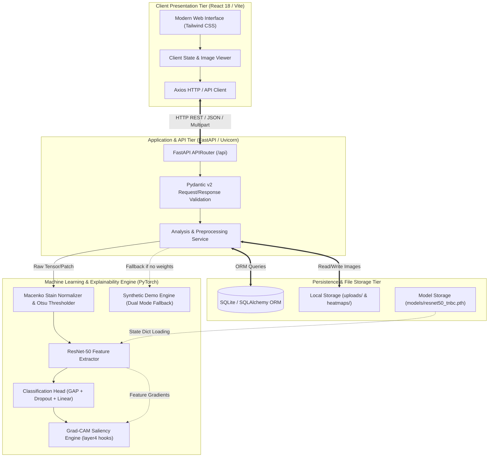
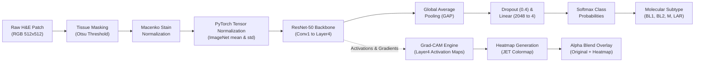
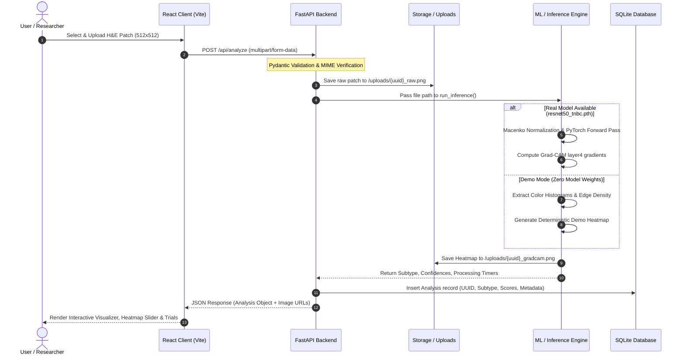

# TNBC-Insight AI: System Architecture Specification

## 1. Architectural Overview

**TNBC-Insight AI** is an explainable AI-assisted research platform designed for histopathological analysis and molecular subtype classification of Triple-Negative Breast Cancer (TNBC). The system is engineered around a decoupled client-server architecture comprising a high-performance React/TypeScript Single Page Application (SPA), a FastAPI asynchronous REST backend, an end-to-end PyTorch computer vision and explainability pipeline, and a lightweight relational database store.

The architecture strictly adheres to modern biomedical machine learning engineering standards: modularity, stateless inference execution, transparent fallbacks (Demo Mode for non-GPU or zero-weight environments), deterministic stain normalization, and real-time gradient-weighted explainability maps.

---

## 2. Machine Learning Pipeline Architecture

The core computer vision pipeline processes high-resolution Hematoxylin and Eosin (H&E) whole-slide image patches to output calibrated molecular subtype probabilities and pixel-level interpretability heatmaps.

### ML Pipeline Stages
1. **Input Ingestion & Validation**: Verifies image dimensions, file headers (TIFF, PNG, JPEG), and ensures patch resolution meets the $512 \times 512$ standard at 20x magnification ($\approx 0.5\,\mu\text{m}/\text{pixel}$).
2. **Tissue Region Detection**: Otsu's automated thresholding converts grayscale luminance to a binary tissue mask, eliminating slide glass background and low-cellularity voids.
3. **Macenko Stain Deconvolution**: Converts RGB transmission values to Optical Density (OD) space using the Beer-Lambert law, decomposes the H&E stain vectors via Singular Value Decomposition (SVD), and maps stain concentrations to a standardized reference matrix.
4. **Deep Feature Extraction**: Preprocessed tensors pass through a deep convolutional network (ResNet-50) pretrained on ImageNet and fine-tuned on TCGA-BRCA histopathology patches.
5. **Subtype Classification**: Global Average Pooling collapses $2048 \times 16 \times 16$ spatial activations into a 2048-dimensional feature vector, followed by a dropout layer and linear classifier producing logits over the four TNBC subtypes (BL1, BL2, M, LAR).
6. **Gradient-Weighted Class Activation Mapping (Grad-CAM)**: Hooks on the final bottleneck block (`layer4`) capture feature activations and backpropagated gradients for the predicted class, producing localized attention weights.

---

## 3. Data Flow Architecture

The data lifecycle within TNBC-Insight AI encompasses client ingestion, persistent storage, asynchronous background execution, and serialized response payloads:

---

## 4. Component Descriptions

### 4.1 Frontend Presentation Tier (`frontend/`)
- **Technology**: React 18, TypeScript, Vite, Tailwind CSS v3, Lucide Icons, Axios.
- **Role**: Delivers an ultra-responsive, zero-latency clinical research interface.
- **Key Modules**:
  - `ImageDropzone`: Handles drag-and-drop file ingestion, drag hover states, and client-side pre-validation (size limits, MIME types).
  - `GradCamViewer`: Interactive dual-layer canvas featuring synchronized zoom, pan, alpha-blending slider (0% to 100% overlay), and colormap toggles.
  - `PipelineVisualizer`: Visual stepper illustrating Otsu segmentation, stain deconvolution, feature extraction, and classification confidence.
  - `SubtypeCard`: Visual profile displaying clinical attributes, genomic pathways, typical IHC profiles, and prognostic data.
  - `HistoryTable`: Searchable, filterable audit log of historical slide evaluations with delete and export capabilities.

### 4.2 Application & REST API Tier (`backend/app/`)
- **Technology**: FastAPI, Pydantic v2, Uvicorn, Python-Multipart.
- **Role**: Orchestrates request routing, input sanitization, error boundaries, file storage, and database persistence.
- **Key Endpoints**:
  - `POST /api/analyze`: Primary inference gateway combining preprocessing, inference, and explainability.
  - `POST /api/preprocess`: Standalone endpoint for viewing step-by-step Otsu masks and Macenko stain separation.
  - `GET /api/history`: Paginated list of historical inferences.
  - `GET /api/model/status`: Diagnostics report returning active model weights, execution device (CPU/CUDA), and demo mode flag.
  - `GET /api/trials`: Curated database of subtype-matched clinical trials.

### 4.3 Machine Learning Engine (`backend/ml/`)
- **Technology**: PyTorch 2.0+, Torchvision, OpenCV (`opencv-python-headless`), NumPy, Scikit-Learn.
- **Key Modules**:
  - `backend/ml/model.py`: Defines the `ResNet50TNBC` neural architecture, custom classification head, and dynamic checkpoint loader.
  - `backend/ml/macenko.py`: Complete implementation of Macenko's stain deconvolution algorithm in optical density space.
  - `backend/ml/preprocessing.py`: Otsu thresholding, tissue contour extraction, and PyTorch tensor preparation.
  - `backend/ml/gradcam.py`: PyTorch forward and backward hook manager extracting layer4 activation maps and computing gradient importance weights.
  - `backend/ml/inference.py`: End-to-end orchestration uniting preprocessing, inference, and heatmap synthesis, with automatic demo fallback.

### 4.4 Data & Storage Tier
- **Technology**: SQLite, SQLAlchemy 2.0 ORM.
- **Role**: Maintains full transactional audit logs for retrospective scientific review.
- **Data Models**:
  - `Analysis`: UUID primary key, timestamp, original file metadata, predicted subtype, softmax probabilities dictionary, execution mode (`demo` vs `research`), inference latency (ms), and file paths for raw and Grad-CAM assets.

---

## 5. Architectural & Technology Rationale

| Decision | Technology Chosen | Rationale & Trade-offs |
| :--- | :--- | :--- |
| **Backend Framework** | **FastAPI** | High throughput via ASGI/Uvicorn, native async Python support, automatic OpenAPI/Swagger documentation, strict Pydantic v2 type checking. |
| **Deep Learning Framework** | **PyTorch 2.x** | Gold standard in medical computer vision research. Native support for intermediate activation hooks (essential for Grad-CAM), dynamic computational graphs, and direct ONNX/TensorRT export. |
| **Vision Backbone** | **ResNet-50** | Balance between representational capacity and parameter efficiency (~25M parameters). Proven feature extractor for histopathological tile classification across TCGA benchmarks without the excessive memory overhead of ViTs. |
| **Color Normalization** | **Macenko Method** | Physical basis in Beer-Lambert absorption law. Superior to simple histogram matching because it explicitly models separate Hematoxylin and Eosin absorption vectors. |
| **Frontend Framework** | **React + Vite + TypeScript** | Sub-second Hot Module Replacement (HMR), compile-time type safety preventing UI runtime crashes, rich ecosystem for medical image manipulation and canvas overlays. |
| **Styling** | **Tailwind CSS v3** | Utility-first CSS providing a clean, dark-mode medical dashboard aesthetic without runtime CSS overhead. |
| **Database** | **SQLite + SQLAlchemy** | Zero external service dependency, perfect for a self-contained research prototype or edge deployment on NVIDIA Jetson, with seamless migration path to PostgreSQL via SQLAlchemy. |
