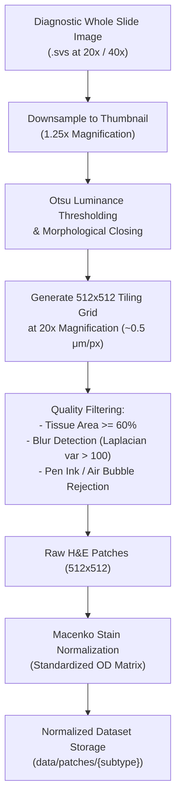

# TNBC-Insight AI: Dataset & Preprocessing Pipeline

## 1. Dataset Overview: The TCGA-BRCA Cohort

The clinical target for **TNBC-Insight AI** is the Triple-Negative Breast Cancer subset derived from **The Cancer Genome Atlas Breast Invasive Carcinoma (TCGA-BRCA)** project, administered by the National Cancer Institute (NCI) and National Human Genome Research Institute (NHGRI).

### Cohort Definition
TNBC cases are clinically identified by negative immunohistochemistry (IHC) staining and in situ hybridization (FISH) for:
- **Estrogen Receptor (ER)**: $< 1\%$ tumor cell nuclear staining (Allred score 0–2)
- **Progesterone Receptor (PR)**: $< 1\%$ tumor cell nuclear staining
- **Human Epidermal Growth Factor Receptor 2 (HER2)**: IHC score 0 or $1+$, or $2+$ with negative FISH amplification ($HER2/\text{CEP17} \text{ ratio} < 2.0$)

From the full TCGA-BRCA repository, **388 Whole Slide Images (WSIs)** corresponding to primary diagnostic biopsy and resection slides of confirmed TNBC cases form the target research corpus.

### Molecular Subtype Breakdown (Lehmann 4-Class)
Using corresponding RNA sequencing profiles categorized according to the Lehmann TNBCtype-4 signature, the WSIs are mapped to:
- **BL1 (Basal-like 1)**: $\approx 35\%$ of cohort
- **BL2 (Basal-like 2)**: $\approx 18\%$ of cohort
- **M (Mesenchymal)**: $\approx 27\%$ of cohort
- **LAR (Luminal Androgen Receptor)**: $\approx 20\%$ of cohort

---

## 2. Preprocessing & Patching Pipeline

Diagnostic WSIs are gigapixel optical scans typically measuring $100,000 \times 80,000$ pixels. Direct inference on such images is computationally intractable; hence, an automated, multi-stage tiling and normalization pipeline is implemented.



### Stage 1: Slide Ingestion & Thumbnail Generation
- Format: Aperio `.svs` or generic multi-resolution `.tiff` пирамид.
- High-level slide overview is extracted at $1.25\times$ magnification for whole-slide tissue boundary identification.

### Stage 2: Automated Tissue Segmentation (Otsu Thresholding)
Glass slide backgrounds are optically clear with high RGB luminance ($> 220$). 
1. Convert the thumbnail to HSV or grayscale color space.
2. Calculate Otsu's optimal global threshold $t^*$ maximizing inter-class variance $\sigma_B^2(t)$:
   $$\sigma_B^2(t) = \omega_0(t)\omega_1(t)\left[\mu_0(t) - \mu_1(t)\right]^2$$
3. Apply binary morphological closing (kernel $5 \times 5$) to fill intracellular gaps while isolating slide margins and glass voids.

### Stage 3: High-Magnification Patch Tiling
- Patches are extracted from the primary slide pyramid at **20x optical magnification** ($\approx 0.50\,\mu\text{m}/\text{pixel}$).
- Target patch size: **$512 \times 512$ pixels**, representing approximately $256 \times 256\,\mu\text{m}$ of physical tissue context.
- Stride: Non-overlapping (stride = 512) for training sets, or $25\%$ overlap (stride = 384) for dense spatial heatmaps.

### Stage 4: Artifact & Quality Filtering
Tiles meeting any of the following criteria are automatically discarded:
- **Low Cellularity**: $< 60\%$ of tile surface area covered by the binary tissue mask.
- **Out-of-Focus / Blur**: Variance of Laplacian filter $< 100.0$:
  $$\text{Var}(\nabla^2 I) = \frac{1}{N}\sum_{x,y} \left(\nabla^2 I(x,y) - \overline{\nabla^2 I}\right)^2$$
- **Marker / Ink Artifacts**: Excessive saturation or chromatic anomalies (e.g. blue or green surgical marker ink).
- **Glass / Air Bubbles**: Low variance high-intensity regions.

### Stage 5: Macenko Stain Normalization
H&E staining intensity varies substantially between pathology laboratories due to reagent age, vendor chemistry, and slide thickness. We utilize the Macenko method based on the Beer-Lambert law:
1. Transform RGB values to Optical Density (OD):
   $$\mathbf{OD} = -\log_{10}\left(\frac{\mathbf{I}}{255}\right)$$
2. Filter transparent pixels with $\mathbf{OD} < \beta$ ($\beta = 0.15$).
3. Compute eigenvectors of the covariance matrix of $\mathbf{OD}$ using Singular Value Decomposition (SVD).
4. Project OD vectors onto the plane spanned by the two largest eigenvectors.
5. Identify the robust extreme angular percentiles (1st and 99th percentiles) representing the Hematoxylin and Eosin stain vectors:
   $$\mathbf{v}_{\text{H}}, \quad \mathbf{v}_{\text{E}}$$
6. Deconvolve stain concentrations and reconstitute using a standardized reference target matrix $\mathbf{S}_{\text{ref}}$ and maximum concentrations $\mathbf{C}_{\text{ref}}$.

---

## 3. Patient-Level Data Splitting

To ensure model generalizability and prevent **data leakage**, data splitting is performed strictly at the **patient / WSI level**, never at the individual patch level:

| Split | Percentage | Number of WSIs | Estimated 512x512 Patches | Purpose |
| :--- | :--- | :--- | :--- | :--- |
| **Train** | **70%** | 272 WSIs | $\approx 220,000$ | Gradient descent parameter optimization |
| **Validation** | **15%** | 58 WSIs | $\approx 47,000$ | Early stopping, hyperparameter tuning |
| **Test** | **15%** | 58 WSIs | $\approx 47,000$ | Final unbiased scientific benchmark |
| **Total** | **100%** | **388 WSIs** | $\approx 314,000$ | Complete research cohort |

> [!IMPORTANT]
> All patches originating from the same surgical patient (TCGA barcode prefix `TCGA-XX-XXXX`) must reside exclusively within a single partition. Mixed patient splits cause severe performance inflation due to shared slide background artifacts.

---

## 4. Directory Structure

```
tnbc-insight-ai/backend/data/
├── raw/
│   └── TCGA-BRCA/
│       ├── TCGA-A2-A0T0-01Z-00-DX1.svs
│       ├── TCGA-A2-A0T2-01Z-00-DX1.svs
│       └── clinical_manifest.csv
├── reference_stain.png
└── patches/
    ├── train/
    │   ├── BL1/
    │   │   ├── TCGA-A2-A0T0_x1024_y2048.png
    │   │   └── ...
    │   ├── BL2/
    │   ├── M/
    │   └── LAR/
    ├── val/
    │   ├── BL1/
    │   ├── BL2/
    │   ├── M/
    │   └── LAR/
    └── test/
        ├── BL1/
        ├── BL2/
        ├── M/
        └── LAR/
```

---

## 5. Dataset Preparation Guide

Follow these steps to extract, filter, normalize, and organize patches from raw whole-slide images:

### Step 1: Download TCGA Diagnostic Slides
Using the GDC Data Transfer Tool or `gdc-client`:
```bash
gdc-client download -m gdc_manifest_tnbc_brca.txt -d data/raw/TCGA-BRCA
```

### Step 2: Tile Slides and Filter Patches
Run the automated patch extraction pipeline:
```bash
python -m ml.preprocessing \
  --input-dir data/raw/TCGA-BRCA \
  --output-dir data/patches \
  --patch-size 512 \
  --magnification 20 \
  --tissue-threshold 0.6 \
  --normalize-stain \
  --reference-image data/reference_stain.png
```

### Step 3: Verify Patch Integrity
Confirm patch counts and class distribution:
```bash
python -c "
import os
for split in ['train', 'val', 'test']:
    print(f'=== Split: {split} ===')
    for c in ['BL1', 'BL2', 'M', 'LAR']:
        p = os.path.join('data/patches', split, c)
        count = len(os.listdir(p)) if os.path.exists(p) else 0
        print(f'  {c}: {count} patches')
"
```

---

## 6. Data Augmentation Recipes

In addition to Macenko normalization, digital pathology models benefit from explicit domain-specific augmentations:

```python
import torchvision.transforms as T

train_transform = T.Compose([
    T.RandomHorizontalFlip(p=0.5),
    T.RandomVerticalFlip(p=0.5),
    T.RandomRotation(degrees=(0, 360)),
    T.ColorJitter(brightness=0.1, contrast=0.1, saturation=0.1, hue=0.05),
    T.ToTensor(),
    T.Normalize(
        mean=[0.485, 0.456, 0.406],
        std=[0.229, 0.224, 0.225]
    )
])

eval_transform = T.Compose([
    T.ToTensor(),
    T.Normalize(
        mean=[0.485, 0.456, 0.406],
        std=[0.229, 0.224, 0.225]
    )
])
```
